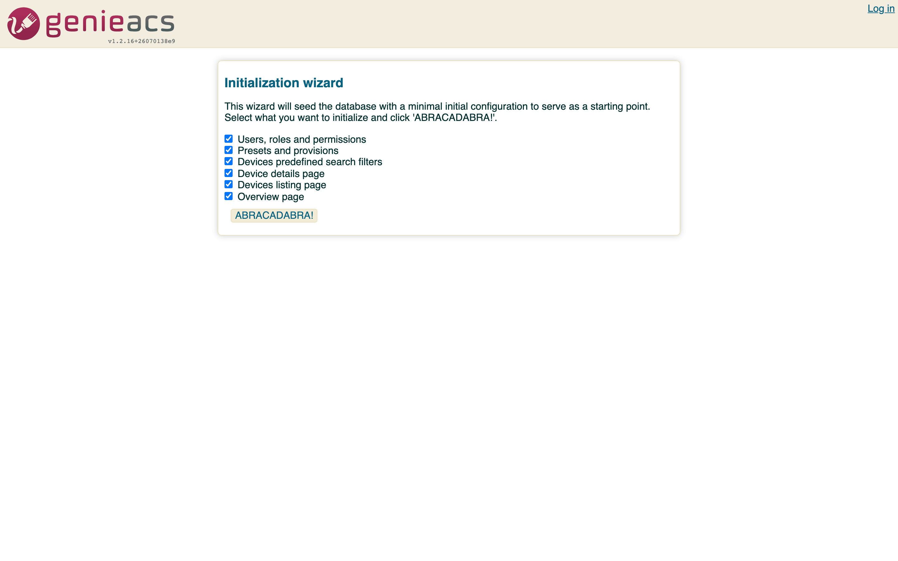

# Your first device

GenieACS manages a device once the device informs to it. A CPE (a router, an ONT, a set-top box) does
that on its own when its ACS URL points at port 7547 of this container. Until you have hardware, the
bundled simulator does the same thing.

## Before the device: the console

On its first visit, http://localhost:3000 shows the initialization wizard. Leave the six options ticked
and click ABRACADABRA!: it creates the `admin` / `admin` user, three presets (`bootstrap`, `default`,
`inform`), the device search filters, the Devices columns and the Overview chart. Log in as `admin` /
`admin`. To change the password, log out and use Change password on the login page, or edit the user
under Admin > Users.



## A real CPE

1. On the device, find the TR-069 (CWMP) settings. Consumer routers put them under Management or
   Administration; ONTs usually take them from the OLT's profile.
2. Set the ACS URL to `http://<host>:7547/`, where `<host>` is the address of the machine running
   Compose, or the address the `genieacs-cwmp` Service gets on Kubernetes. Leave the ACS username and
   password empty; the container does not require them.
3. Turn on periodic inform if the device has the switch. The `inform` preset the wizard created sets the
   interval to 300 seconds on the first inform.
4. Reboot the device or save the settings. Its first inform reaches port 7547 within a minute, and the
   device appears under Devices with its serial number, product class and software version.

What working looks like: the Devices list has a row for the device, Last inform shows seconds ago, and
`docker compose exec genieacs tail -n 20 /var/log/genieacs/genieacs-cwmp-access.log` shows a line per
inform. If the row never appears, see [Troubleshooting](troubleshooting.md#a-device-never-appears).

## The simulator

`docker-compose.yml` ships the upstream GenieACS simulator as a profile:

```bash
docker compose --profile testing up -d
```

One fake device, `202BC1-BM632w-000000` (a Huawei BM632w data model with invented serials), informs to
`genieacs:7547` inside the Compose network and appears under Devices within a few seconds. For more than
one, override the command in a `docker-compose.override.yml`:

```yaml
services:
  genieacs-sim:
    command: ["./genieacs-sim", "-u", "http://genieacs:7547/", "-p", "6"]
```

`-p 6` runs six devices, serials `000000` to `000005`. The simulator's other options are on the
[genieacs-sim-container](https://github.com/GeiserX/genieacs-sim-container) page.

## What you can do with a device

Open a device from the list. The page shows what the wizard configured: last inform, serial number,
product class, OUI, manufacturer, hardware and software versions, MAC, IP, WLAN settings and the LAN
hosts table, and the task buttons: Reboot, Reset, Push file, Delete. Tags on the device page
are what [presets](usage.md#presets-and-files) target.


