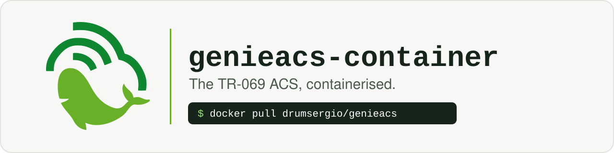
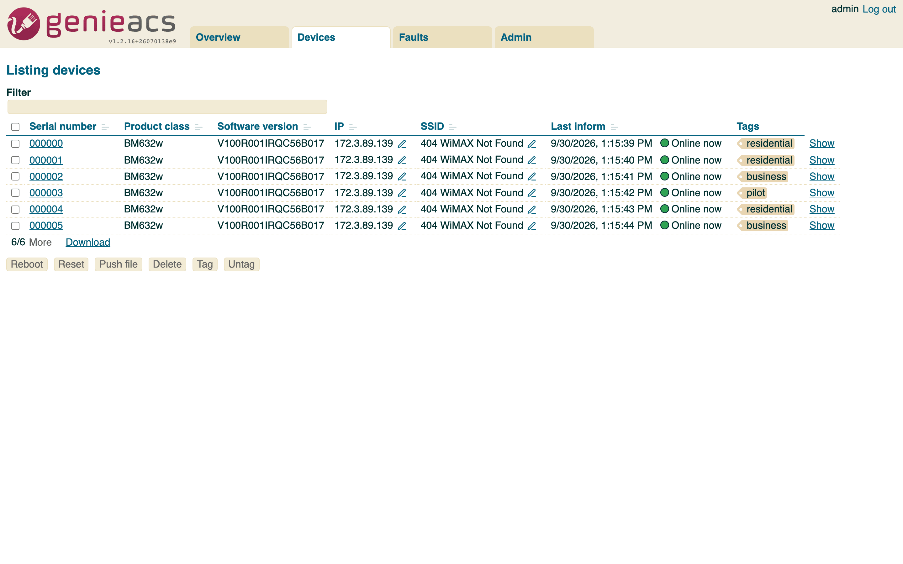
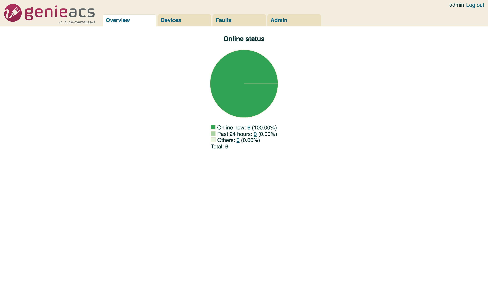
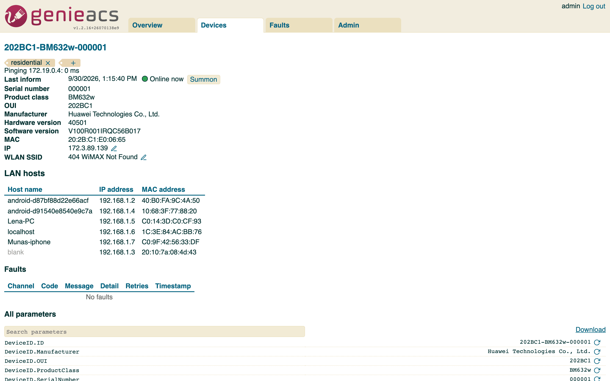
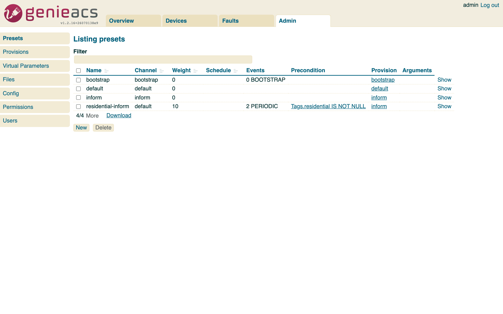
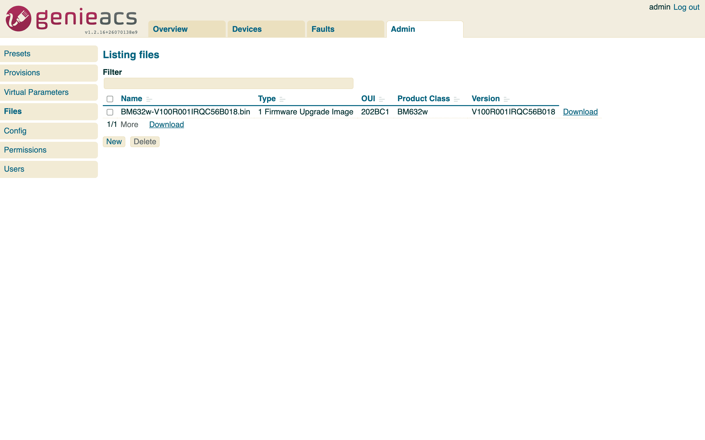
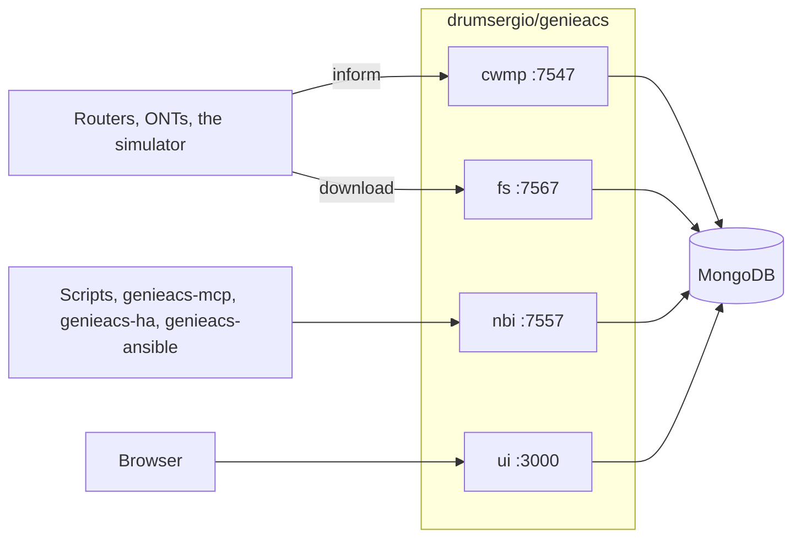

---
hide:
  - navigation
---

# genieacs-container { .gc-visually-hidden }

  

  
  
  
  
  

---

**genieacs-container** is a Docker image and a Helm chart for [GenieACS](https://genieacs.com), the open-source TR-069 ACS that manages routers, ONTs and other CPE devices. GenieACS itself ships no container. This image runs its four services in one container, for amd64 and arm64, with MongoDB beside it: on one host with [Docker Compose](getting-started.md#docker-compose), or on Kubernetes with the [Helm chart](getting-started.md#kubernetes-with-helm). It packages GenieACS 1.2.16 and does not change it.

This address is also the Helm chart repository: `helm repo add genieacs https://geiserx.github.io/genieacs-container`.

-   :material-docker: **[Run with Docker Compose](getting-started.md)**

    ---

    One file, `docker compose up -d`, and the GenieACS console is on port 3000 in about a minute.

-   :material-router-wireless: **[Your first device](first-device.md)**

    ---

    Point a CPE, or the bundled simulator, at port 7547 and watch it appear under Devices.

-   :material-view-dashboard-outline: **[Usage](usage.md)**

    ---

    The four services, the simulator and MCP profiles, extension scripts and the logs.

-   :material-tune: **[Configuration](configuration.md)**

    ---

    Every port, volume and environment variable, and the chart values that matter.

## What it looks like

The console is upstream GenieACS 1.2.16, served by image `1.2.16.6`. The devices in these screenshots are the [bundled simulator](first-device.md#the-simulator) (`--profile testing`), so you can see the same thing without hardware.

<figure markdown>

<figcaption>Overview: who is online</figcaption>
</figure>
<figure markdown>

<figcaption>One device, every parameter</figcaption>
</figure>
<figure markdown>

<figcaption>Presets: configuration for many devices</figcaption>
</figure>
<figure markdown>

<figcaption>Files: firmware devices download</figcaption>
</figure>

## What is in the image

- The four GenieACS services in one container, under supervisord: `genieacs-cwmp` on 7547 (the ACS URL devices inform to), `genieacs-nbi` on 7557 (the REST API), `genieacs-fs` on 7567 (the file server) and `genieacs-ui` on 3000 (the console).
- GenieACS built from the upstream `v1.2.16` tag on Node 24, on Debian bookworm-slim. The image tag is the upstream version plus a build number: `1.2.16.6`.
- Logs rotated for you: each service writes its own file under `/var/log/genieacs`, and cron runs logrotate daily, 30 days kept, compressed.
- The GenieACS processes run as the unprivileged `genieacs` user (uid 999). Root is used once, to start cron, then dropped with `gosu`.
- MongoDB is not in the image. Compose starts `mongo:8.0` beside it; the chart bundles a MongoDB subchart for evaluation or takes your own.

## How it runs

- On one host: `docker-compose.yml` runs the image and MongoDB on a private network, exposes the four ports, and keeps two optional services behind profiles: the [simulator](first-device.md#the-simulator) (`--profile testing`) and the [MCP server](usage.md#optional-compose-services) (`--profile mcp`).
- On Kubernetes: the chart makes one Deployment, one Service per port, a PersistentVolumeClaim for extension scripts, and, when you turn them on, an Ingress or a Gateway API HTTPRoute for the console and a PodDisruptionBudget. MongoDB comes from the bundled subchart, or from your own instance through `externalMongodb.url` or a Kubernetes Secret. See [Getting started](getting-started.md#kubernetes-with-helm) and [How it works](how-it-works.md).
- Health: a Compose healthcheck on port 3000, and liveness and readiness probes in the chart.
- Upgrades: the tag moves when upstream GenieACS moves. Change the pin, `docker compose up -d` or `helm upgrade`, and the data in MongoDB stays. The [changelog](https://github.com/GeiserX/genieacs-container/blob/main/CHANGELOG.md) lists every image and chart release.

## What it does not do

- It does not change GenieACS. Provisions, presets, virtual parameters and the UI are upstream's; the [GenieACS documentation](https://docs.genieacs.com) covers them.
- It does not terminate TLS. Put a reverse proxy, an Ingress or an HTTPRoute in front of the console and the CWMP port before exposing them.
- The bundled MongoDB subchart is for evaluation. Production runs MongoDB separately and points the chart at it.
- It runs one GenieACS replica by default.

## Security

- Set your own `GENIEACS_UI_JWT_SECRET` with `openssl rand -hex 32`. Neither the compose file nor the chart has a default, and both refuse to start without one; the chart also refuses placeholders such as `changeme` and takes the secret from an existing Kubernetes Secret through `uiJwtSecret.existingSecret`.
- Turn on MongoDB authentication. The compose file has the lines commented; the chart has `mongodb.auth.enabled`.
- In the chart, keep credentials out of `values.yaml`: `externalMongodb.existingSecret` for the connection string, `uiJwtSecret.existingSecret` for the UI secret, `envFrom` or `extraEnvVars` for the rest. See [Configuration](configuration.md#security).
- The pod starts as root for cron and drops every capability except `SETUID` and `SETGID`; the GenieACS processes run as uid 999.
- To report a security problem, follow the [security policy](https://github.com/GeiserX/genieacs-container/blob/main/SECURITY.md) and do not open a public issue.

## Getting help

- If something is broken, read [Troubleshooting](troubleshooting.md), then open an issue with the details it lists.
- The [changelog](https://github.com/GeiserX/genieacs-container/blob/main/CHANGELOG.md) lists what changed between releases.
- For GenieACS itself (provisions, data models, device quirks), the [GenieACS documentation](https://docs.genieacs.com) and the [GenieACS forum](https://forum.genieacs.com) are the places.
- The Ansible collection, the MCP server, the Home Assistant integration and the simulator are on [Related projects](related.md).
- To build the image or send a fix, read [Development](development.md).

## License

genieacs-container (the Dockerfile, the chart and the scripts) is released under the [GPL-3.0-or-later](https://github.com/GeiserX/genieacs-container/blob/main/LICENSE) license. GenieACS, which the image packages, is [AGPL-3.0](https://github.com/genieacs/genieacs/blob/master/LICENSE).
